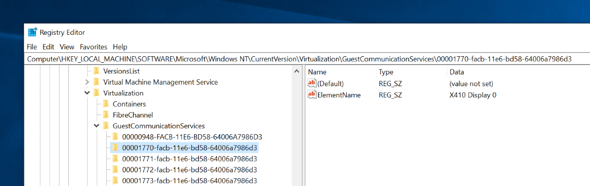
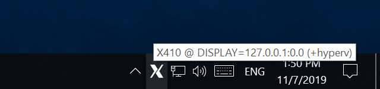
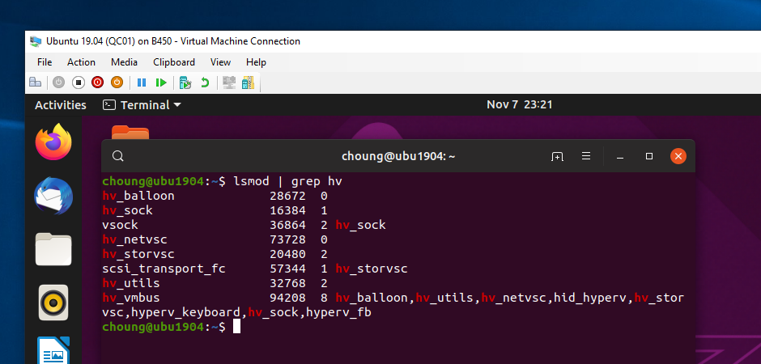
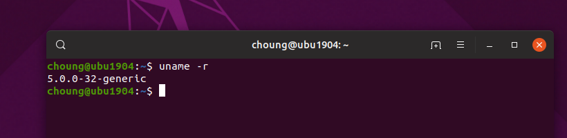
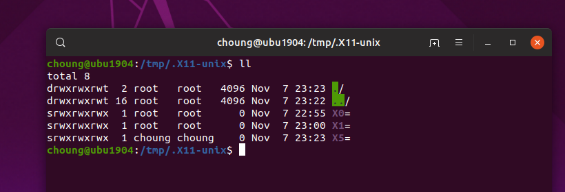

# VSOCK (Hyper-V) Support in X410

## Windows 10

### Add Windows registry entries

X410 runs in a secure sandbox and it cannot directly modify Windows registry. Hence you need to manually make the changes in Windows registry as described below.

In order to have X410 communicate with Hyper-V virtual machines via VSOCK, you first need to add a Windows registry key under `'HKEY_LOCAL_MACHINE\SOFTWARE\Microsoft\Windows NT\CurrentVersion\Virtualization\GuestCommunicationServices'`. The new registry key must be in the following format:

```text
<portnumber>-facb-11e6-bd58-64006a7986d3-facb-11e6-bd58-64006a7986d3
```

<code>&lt;portnumber&gt;</code> is derived from the display number set for X410. If it's set to be '0', <code>&lt;portnumber&gt;</code> must be '6000 + 0 (= display number)' in 4-byte hexadecimal format; `00001770`. Hence the new registry key becomes `'00001770-facb-11e6-bd58-64006a7986d3'`. For the display number `1`, it becomes `'00001771-facb-11e6-bd58-64006a7986d3'` and so forth.
Under the new registry key, you also need to add the following string value for a friendly name that describes what the key is used for:

```text
"ElementName"="X410 Display 0"
```



```ini
Windows Registry Editor Version 5.00

[HKEY_LOCAL_MACHINE\SOFTWARE\Microsoft\Windows NT\CurrentVersion\Virtualization\GuestCommunicationServices\00001770-facb-11e6-bd58-64006a7986d3]
"ElementName"="X410 Display 0"
```

You can also download one of the following registry files for adding the entries mentioned above. You can import it from 'Registry Editor (regedit.exe)' in Windows.

* [Entries for display 0 only](x410-display-0-only.reg)
* [Entries for display 0 to 5](x410-display-0-to-5.reg)

### Start X410 in Windowed Apps mode with Hyper-V (VSOCK) option enabled

In order to enable the VSOCK feature in X410, you need to launch X410 with a [command line switch](https://x410.dev/cookbook/command-line-switches/) `'/listen hyperv'`. You can use command-line switches directly from Windows Start menu, Windows Command Prompt or PowerShell.

```cmd
x410 /listen hyperv /wm
```

When the Hyper-V (VSOCK) option is properly enabled, X410 adds a `'+hyperv'` text label to its tray icon tooltip.



## Hyper-V Linux Virtual Machine

In this guide, we're showing command-line examples for Ubuntu. However, you shouldn't have any problem applying the same procedure for other Linux distributions; you just might need to adjust the commands for installing programs (ex. 'sudo pacman -S socat' for installing socat in Arch Linux).

### Check 'hv_sock' Linux module

In order for our VSOCK method to work, you need to make sure **'hv_sock'** Linux module is installed on your virtual machine. For checking the installed modules, you can use `'lsmod'` command.

```bash
lsmod | grep hv
```



If you cannot find 'hv_sock', you should be able to install it by using the following commands.

```bash
sudo sh -c 'echo "hv_sock" > /etc/modules-load.d/hv_sock.conf'
sudo reboot
```

Please also check the version of your Linux and make sure its version is 4.14 or higher. Hyper-V (hv_sock) is supported since Linux 4.14.

```bash
uname -r
```



### Install 'socat'

Although X410 can be directly connected via VSOCK from Hyper-V Linux virtual machines, X-Window apps and tools are not built for VSOCK; we need an intermediate data relay server that can be seen as an X-Window server for those programs.

In this example, we're using a popular utility program called '[socat](http://www.dest-unreach.org/socat/)'. socat is used in order to simply demonstrate the possibility of using VSOCK; it's definitely not used for its performance.

```bash
sudo apt update && sudo apt install socat
```

You can then execute the following command to create a virtual X-Window server that forwards data to and from X410.

```bash
socat -b65536 UNIX-LISTEN:/tmp/.X11-unix/X5,fork,mode=777 SOCKET-CONNECT:40:0:x0000x70170000x02000000x00000000 &
```

Please note that the above command creates a server at display number '**5**'. So you should set the DISPLAY environment variable as the following in order to have X-Window apps use this server:

```bash
export DISPLAY=:5.0
```

Please also note that we're using a display number '5' instead of '0'. It can be any number, but `'0'` is already used by the Linux GUI desktop running on Hyper-V console.
Before assigning a display number, check `'/tmp/.X11-unix/'` folder and just make sure your display number is not already in use (`X<display-number>`; X0, X10 and etc.).



### Run Linux GUI apps

You're now ready to start Linux GUI apps and open them on Windows via X410. Please note that instead of using the 'export' command shown above, you should also be able to use a command-line switch for most Linux GUI apps (ex. `firefox --display :5.0`).

Please also note that some Linux GUI apps have a main hidden background program that manages its visible instances (ex. GNOME Terminal, FireFox and etc.). For such programs, you may not be able to start a new instance for a display number that is different from its first instance. For example, when you already have a FireFox opened on your Hyper-V console, you cannot open another FireFox on Windows via X410; you first need to close the FireFox on Hyper-V console.


## Links

Sources:

* [Quick Testing VSOCK (Hyper-V) Support in X410 - X410.dev](https://x410.dev/cookbook/hyperv/quick-testing-vsock-hyper-v-support-in-x410/)
